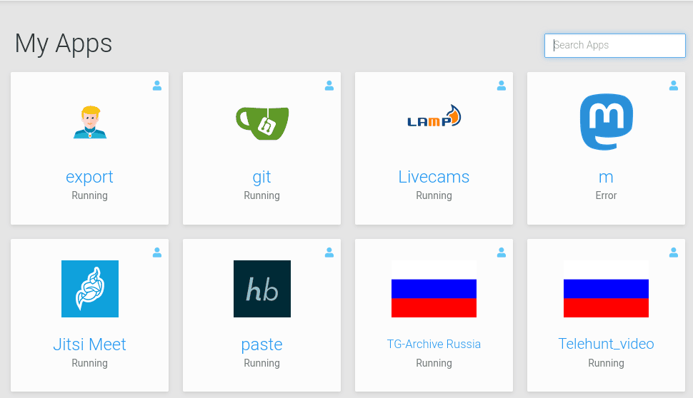

# Cloudron.io

See [cloudron.io](https://www.cloudron.io/)

The OSINTUkraine instance of cloudron.io is run by Ben Borges and available for
logged-in members at [my.osintukraine.com](https://my.osintukraine.com/).

The cloudron platform powers the other sub-sites of osintukraine.com - it is a
one-click "no-code" tool that allows spinning up new programs very fast at
sub-domains, e.g. [russia.osintukraine.com](https://russia.osintukraine.com/).

See the **[Services](services.md) section** for all running services.

Example:

